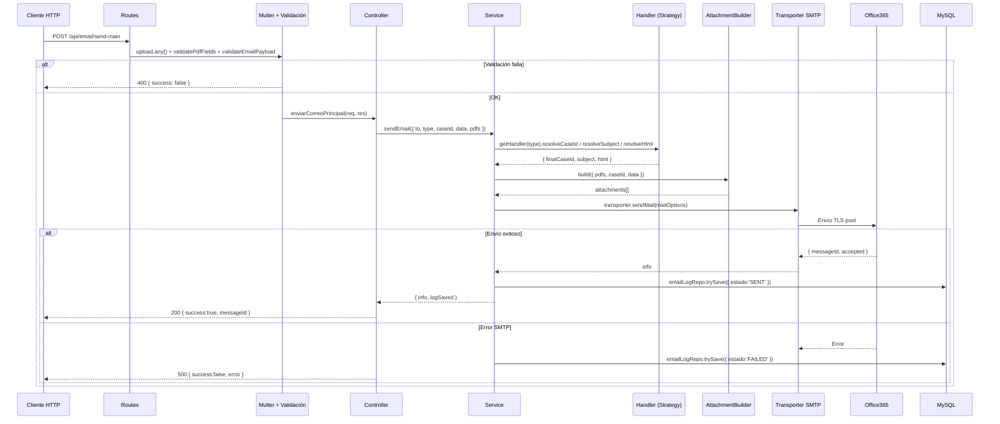
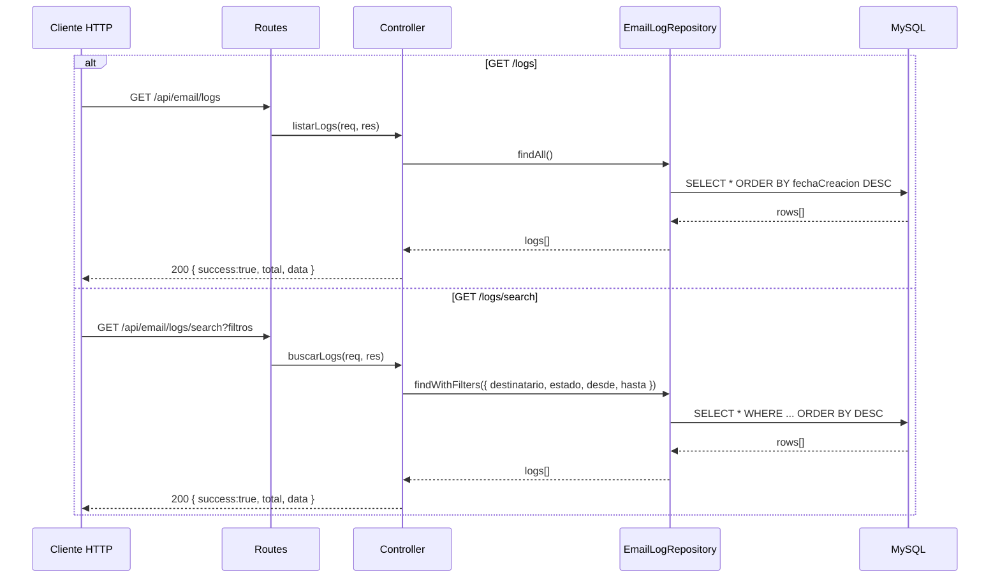

# API-CORREOS-RRPP

> API REST de correos transaccionales para **Notaría Tambini**.  
> Centraliza el envío de emails HTML personalizados (trámites RRPP y recibos de pago) con soporte de adjuntos PDF, dos cuentas SMTP y registro de logs en MySQL.

---

## Índice

1. [Descripción general](#1-descripción-general)
2. [Stack tecnológico](#2-stack-tecnológico)
3. [Arquitectura](#3-arquitectura)
4. [Estructura del proyecto](#4-estructura-del-proyecto)
5. [Primeros pasos](#5-primeros-pasos)
6. [Variables de entorno](#6-variables-de-entorno)
7. [Endpoints de la API](#7-endpoints-de-la-api)
8. [Plantillas RRPP](#8-plantillas-rrpp)
9. [Diagramas de secuencia](#9-diagramas-de-secuencia)
10. [Tests](#10-tests)
11. [Despliegue a producción](#11-despliegue-a-producción)
12. [Cosas a mejorar (Roadmap)](#12-cosas-a-mejorar-roadmap)

---

## 1. Descripción general

El sistema recibe peticiones HTTP con datos del trámite, selecciona la plantilla HTML correcta, adjunta PDFs si aplica, envía el correo vía **Office365 SMTP** y registra el resultado (éxito o fallo) en una base de datos **MySQL**.

**Casos de uso principales:**
- Notificar a clientes sobre el estado de sus trámites en SUNARP (9 tipos de mensaje)
- Enviar recibos/boletas de pago con PDF adjunto
- Consultar historial de correos enviados con filtros

---

## 2. Stack tecnológico

| Capa | Tecnología | Versión |
|---|---|---|
| Runtime | Node.js | ≥ 18 |
| Framework HTTP | Express | 5.x |
| SMTP | Nodemailer (pool) | 7.x |
| ORM | Sequelize | 6.x |
| Base de datos | MySQL | 8.x |
| Upload archivos | Multer (memoria RAM) | 2.x |
| Config | dotenv | 17.x |
| Testing | Jest + Supertest | — |
| Dev server | nodemon | — |

---

## 3. Arquitectura

### Flujo de capas

```
┌─────────────────────────────────────────────────────────┐
│  Cliente HTTP (Sistema interno / ERP)                    │
└────────────────────┬────────────────────────────────────┘
                     │ POST /api/email/send-main
                     ▼
┌─────────────────────────────────────────────────────────┐
│  Routes  →  Middlewares (Multer, Validación)            │
└────────────────────┬────────────────────────────────────┘
                     ▼
┌─────────────────────────────────────────────────────────┐
│  Controller  →  Service (Orquestador)                   │
│    ├── Handler (Strategy Pattern)                        │
│    │     ├── rrpp.handler  → rrppTemplates[caseId]      │
│    │     └── recibo.handler → reciboTemplate            │
│    ├── AttachmentBuilder (PDFs + devolucion.pdf)        │
│    └── MailBuilder (mailOptions)                        │
└────────────────────┬────────────────────────────────────┘
                     ▼
        ┌────────────┴────────────┐
        ▼                         ▼
┌──────────────┐        ┌─────────────────────┐
│ SMTP Office365│        │ MySQL (email_log_rp) │
│ (Nodemailer) │        │ (via Sequelize)      │
└──────────────┘        └─────────────────────┘
```

### Patrones de diseño aplicados

| Patrón | Dónde | Para qué |
|---|---|---|
| **Strategy** | `src/handlers/` | Cada tipo de email (`rrpp`, `recibo`) es una estrategia intercambiable |
| **Repository** | `src/repositories/` | Abstrae la BD — el service no conoce Sequelize |
| **Builder** | `src/builders/` | Construye adjuntos y `mailOptions` de forma aislada |
| **Factory** | `src/config/transporter.js` | Crea los transporters SMTP por cuenta |

---

## 4. Estructura del proyecto

```
API-CORREOS-RRPP/
├── server.js                        # Punto de entrada — arranca en PORT del .env
├── .env                             # Variables de entorno (NO commitear)
├── src/
│   ├── app.js                       # Express: CORS, JSON, rutas
│   ├── config/
│   │   ├── database.js              # Sequelize → MySQL
│   │   ├── transporter.js           # Nodemailer — 2 cuentas SMTP
│   │   └── env.js                   # Valida vars obligatorias al arrancar
│   ├── constants/
│   │   └── emailTypes.js            # EMAIL_TYPES, ACCOUNT_TYPES (sin magic strings)
│   ├── middlewares/
│   │   ├── upload.middleware.js     # Multer (PDF en memoria, max 15MB x 30 archivos)
│   │   └── validateEmailPayload.js  # Valida 'to' y 'type'
│   ├── routes/
│   │   └── email.routes.js          # 4 endpoints
│   ├── controllers/
│   │   └── email.controller.js      # req → service → res
│   ├── services/
│   │   └── email.service.js         # Orquestador principal
│   ├── handlers/                    # Strategy Pattern
│   │   ├── index.js                 # getHandler(type)
│   │   ├── rrpp.handler.js          # Estrategia para type='rrpp'
│   │   └── recibo.handler.js        # Estrategia para type='recibo'
│   ├── builders/
│   │   ├── attachment.builder.js    # Construye adjuntos + auto-attach devolucion.pdf
│   │   └── mail.builder.js          # Construye mailOptions
│   ├── repositories/
│   │   └── emailLog.repository.js   # Repository Pattern — acceso a BD
│   ├── models/
│   │   └── EmailLogRp.js            # Modelo Sequelize → tabla email_log_rp
│   ├── helpers/
│   │   ├── rrpp/
│   │   │   ├── index.js             # Re-exporta rrppTemplates
│   │   │   ├── utils.js             # shouldShowTestimonio, getWhatsappData
│   │   │   ├── components.js        # Bloques HTML reutilizables
│   │   │   └── templates/
│   │   │       ├── case1.template.js  # Trámite presentado en SUNARP
│   │   │       ├── case2.template.js  # Inscrito con devolución
│   │   │       ├── case3.template.js  # Inscrito
│   │   │       ├── case4.template.js  # Inscrito + dev. (empresa)
│   │   │       ├── case5.template.js  # Inscrito (empresa)
│   │   │       ├── case6.template.js  # Liquidado
│   │   │       ├── case7.template.js  # Observado
│   │   │       ├── case8.template.js  # Tachado
│   │   │       ├── case9.template.js  # Genérico (estado dinámico)
│   │   │       └── case10.template.js # Inscrito (kardex V/N/C/T/L)
│   │   └── recibopago.template.js   # Template de recibo de pago
│   └── files/
│       └── devolucion.pdf           # PDF adjuntado automáticamente en caseId=2
└── tests/
    ├── jest.setup.js                # Vars de entorno para tests (sin tocar .env)
    ├── unit/
    │   ├── rrpp.utils.test.js
    │   ├── rrpp.handler.test.js
    │   ├── recibo.handler.test.js
    │   └── attachment.builder.test.js
    ├── integration/
    │   └── email.endpoints.test.js
    └── smoke/
        └── send-real.js             # Envío real para validar antes de deploy
```

---

## 5. Primeros pasos

### Requisitos previos

- Node.js ≥ 18
- MySQL 8 corriendo (local o remoto)
- Acceso a las credenciales SMTP de Office365

### Instalación

```bash
# 1. Clonar el repo
git clone <url-del-repo>
cd API-CORREOS-RRPP

# 2. Instalar dependencias
npm install

# 3. Crear el archivo de variables de entorno
cp .env.example .env   # o crear .env manualmente (ver sección 6)

# 4. Arrancar en modo desarrollo
npm run dev
# → 🚀 Servidor corriendo en http://localhost:3015
```

> Si falta alguna variable de entorno obligatoria, el servidor **no arranca** y muestra exactamente qué variable falta.

---

## 6. Variables de entorno

Crear un archivo `.env` en la raíz con estas variables:

```env
# ── SMTP Office365 ─────────────────────────────
SMTP_HOST=smtp.office365.com
SMTP_PORT=587

# Cuenta principal (trámites RRPP)
SMTP_USER_MAIN=registrospublicos@notariatambini.com
SMTP_PASS_MAIN=TuPasswordMain

# Cuenta secundaria (informes)
SMTP_USER_SECOND=informes@notariatambini.com
SMTP_PASS_SECOND=TuPasswordSecond

# ── Servidor ────────────────────────────────────
HOST=192.168.1.20
PORT=3015

# ── MySQL ───────────────────────────────────────
DB_HOST=192.168.1.20
DB_PORT=3307
DB_USER=usuario_root
DB_PASSWORD=tuPassword
DB_NAME=dbincidencias
```

> ⚠️ **Nunca committear el `.env`** — ya está en `.gitignore`.

---

## 7. Endpoints de la API

Base URL: `http://localhost:3015/api/email`

### POST `/send-main` — Enviar desde cuenta principal

Envía desde `registrospublicos@notariatambini.com`.

**Content-Type:** `multipart/form-data`

| Campo | Tipo | Requerido | Descripción |
|---|---|---|---|
| `to` | string | ✅ | Email del destinatario |
| `type` | string | ✅ | `"rrpp"` o `"recibo"` |
| `caseId` | string | Solo `rrpp` | ID de plantilla (1–10) |
| `subject` | string | ❌ | Asunto personalizado (si no, lo genera la plantilla) |
| `cc` | string | ❌ | Correo en copia |
| `data` | JSON string | ❌ | Variables para la plantilla |
| `cliente` | string | ❌ | Shortcut: equivale a `data: { cliente: "..." }` |
| `pdfs[0]`...`pdfs[N]` | file | ❌ | PDFs adjuntos (max 15MB c/u, max 30 archivos) |

**Respuesta exitosa:**
```json
{
  "success": true,
  "message": "Correo enviado desde cuenta principal",
  "to": ["cliente@example.com"],
  "messageId": "<abc123@notariatambini.com>"
}
```

---

### POST `/send-second` — Enviar desde cuenta secundaria

Igual que `/send-main` pero usa `informes@notariatambini.com`. No admite `cc`.

---

### GET `/logs` — Listar todos los registros

Retorna todos los correos enviados ordenados por fecha (más reciente primero).

```bash
GET /api/email/logs
```

```json
{
  "success": true,
  "total": 142,
  "data": [
    {
      "id": 142,
      "destinatario": "cliente@example.com",
      "asunto": "COMUNICACIÓN POR TRÁMITE PRESENTADO - K-001",
      "tipo": "rrpp",
      "caseId": "1",
      "estado": "SENT",
      "messageId": "<abc@notariatambini.com>",
      "cuenta": "main",
      "fechaCreacion": "2025-09-15T10:30:00.000Z"
    }
  ]
}
```

---

### GET `/logs/search` — Buscar con filtros

```bash
GET /api/email/logs/search?destinatario=cliente@x.com&estado=SENT&desde=2025-01-01&hasta=2025-12-31
```

| Parámetro | Tipo | Descripción |
|---|---|---|
| `destinatario` | string | Email exacto del destinatario |
| `estado` | string | `SENT` o `FAILED` |
| `desde` | string (YYYY-MM-DD) | Fecha inicio (huso horario Lima -05:00) |
| `hasta` | string (YYYY-MM-DD) | Fecha fin |

---

## 8. Plantillas RRPP

Usar `type: "rrpp"` con el `caseId` correspondiente:

| caseId | Asunto generado | Variables requeridas |
|---|---|---|
| `1` | COMUNICACIÓN POR TRÁMITE PRESENTADO | `kardex`, `numeroTitulo`, `oficinaRegistral` |
| `2` | COMUNICACIÓN POR TRÁMITE INSCRITO CON DEVOLUCIÓN | `kardex`, `numeroTitulo`, `montoDevolucion`, `telefono` |
| `3` | COMUNICACIÓN POR TRÁMITE INSCRITO | `kardex`, `numeroTitulo`, `telefono` |
| `4` | COMUNICACIÓN... INSCRITO CON DEVOLUCIÓN (EMPRESA) | `kardex`, `montoDevolucion`, `telefono` |
| `5` | COMUNICACIÓN... INSCRITO (EMPRESA) | `kardex`, `telefono` |
| `6` | COMUNICACIÓN POR TRÁMITE LIQUIDADO | `kardex`, `numeroTitulo`, `montoDevolucion`, `telefono` |
| `7` | COMUNICACIÓN POR TRÁMITE OBSERVADO | `kardex`, `numeroTitulo`, `montoDevolucion`, `telefono` |
| `8` | COMUNICACIÓN POR TRÁMITE TACHADO | `kardex`, `numeroTitulo` |
| `9` | COMUNICACIÓN POR TRÁMITE EN RR.PP. | `kardex`, `numeroTitulo`, `estado` |
| `10` | COMUNICACIÓN POR TRÁMITE INSCRITO | `kardex`, `numeroTitulo`, `telefono` |

> **Alias automático:** Si `caseId=3` y el `kardex` empieza con **V, N, C, T o L**, el sistema redirige automáticamente a la plantilla `10`.

> **Auto-adjunto:** Si `caseId=2` y `montoDevolucion >= 10`, se adjunta automáticamente `devolucion.pdf`.

> **Testimonio:** Si `kardex` empieza con **K**, se muestra aviso de recojo de testimonio en las plantillas que aplica.

### Ejemplo de request (cURL)

```bash
curl -X POST http://localhost:3015/api/email/send-main \
  -F "to=cliente@example.com" \
  -F "type=rrpp" \
  -F "caseId=1" \
  -F 'data={"kardex":"K-2025-001","numeroTitulo":"2025-99999","oficinaRegistral":"Lima"}'
```

### Ejemplo recibo de pago

```bash
curl -X POST http://localhost:3015/api/email/send-second \
  -F "to=cliente@example.com" \
  -F "type=recibo" \
  -F "cliente=Juan Pérez" \
  -F "pdfs[0]=@/ruta/al/recibo.pdf"
```

---

## 9. Diagramas de secuencia

### Envío de correo



### Consulta de logs



---

## 10. Tests

### Correr los tests

```bash
# Todos los tests (unitarios + integración)
npm test

# Con reporte de cobertura
npm run test:coverage

# Un archivo específico
npx jest tests/unit/rrpp.handler.test.js
```

> Los tests **mockean** SMTP y MySQL — no necesitas conexión real para correrlos.

### Estructura de tests

```
tests/
├── jest.setup.js                      # Vars de entorno de prueba
├── unit/
│   ├── rrpp.utils.test.js             # shouldShowTestimonio, getWhatsappData
│   ├── rrpp.handler.test.js           # Los 10 cases + alias caseId=3→10
│   ├── recibo.handler.test.js         # Boleta con fallbacks de nombre
│   └── attachment.builder.test.js     # Orden PDFs, devolucion.pdf, sanitización
├── integration/
│   └── email.endpoints.test.js        # Todos los endpoints HTTP con mocks
└── smoke/
    └── send-real.js                   # Envío real (ejecutar manualmente antes de deploy)
```

### Smoke test antes de deploy (envío real)

```bash
# Verifica que las credenciales SMTP del .env funcionen correctamente
node tests/smoke/send-real.js
```

Envía 3 correos reales y muestra el resultado. Si algo falla, saldrá con código 1.

### Resultado esperado

```
Test Suites: 5 passed, 5 total
Tests:       83 passed, 83 total
```

---

## 11. Despliegue a producción

### Pre-deploy checklist

- [ ] `npm test` — todos los tests pasan
- [ ] `node tests/smoke/send-real.js` — correos llegan correctamente
- [ ] `.env` configurado en el servidor con las credenciales de producción
- [ ] MySQL accesible desde el servidor destino
- [ ] Puerto `3015` abierto en el firewall del servidor

### Arrancar en producción

```bash
# Opción 1 — directo
npm start

# Opción 2 — con PM2 (recomendado para producción)
pm2 start server.js --name api-correos-rrpp
pm2 save
pm2 startup
```

### Con PM2 (proceso persistente)

```bash
# Ver logs en tiempo real
pm2 logs api-correos-rrpp

# Reiniciar tras un deploy
pm2 restart api-correos-rrpp

# Ver estado
pm2 status
```

### Tabla de puertos

| Servicio | Puerto |
|---|---|
| API REST | 3015 |
| MySQL | 3307 |
| SMTP Office365 | 587 (TLS) |

---

## 12. Cosas a mejorar (Roadmap)

### 🔴 Prioritario

| Mejora | Descripción |
|---|---|
| **Tests de SMTP en CI/CD** | Configurar GitHub Actions para correr `npm test` en cada PR automáticamente |
| **Rate limiting** | Agregar `express-rate-limit` para evitar abuso de los endpoints de envío |
| **Autenticación** | Los endpoints actualmente son públicos. Agregar API Key o JWT para protegerlos |

### 🟡 Medio plazo

| Mejora | Descripción |
|---|---|
| **Cola de emails** | Usar Bull/BullMQ con Redis para reintentos automáticos cuando Office365 falla temporalmente |
| **Notificación de FAILED** | Si un correo queda en estado `FAILED` en la BD, enviar alerta al equipo TI |
| **Paginación en /logs** | El endpoint `/logs` devuelve todos los registros sin límite. Agregar `?page=1&limit=50` |
| **Soporte HTML adjunto** | Actualmente solo PDF. Evaluar si se necesita otros formatos |

### 🟢 Mejoras técnicas

| Mejora | Descripción |
|---|---|
| **TypeScript** | Migrar a TS para tipado estático y mejor autocompletado |
| **Variables de entorno tipadas** | Usar `zod` para validar y tipar el `.env` al arrancar |
| **Swagger/OpenAPI** | Documentar los endpoints con UI interactiva en `/api/docs` |
| **Logging centralizado** | Agregar `winston` o `pino` para logs estructurados con niveles (info/warn/error) |
| **Health check endpoint** | `GET /health` que verifique conexión SMTP y MySQL |

---

## Agregar una nueva plantilla RRPP

1. Crear `src/helpers/rrpp/templates/caseN.template.js` siguiendo el mismo patrón
2. Registrarla en `src/helpers/rrpp/index.js`:
   ```js
   const rrppTemplates = {
     // ... casos existentes
     11: require('./templates/case11.template'),
   };
   ```
3. Agregar un test en `tests/unit/rrpp.handler.test.js`
4. **Listo** — sin tocar `email.service.js` ni ningún otro archivo

## Agregar un nuevo tipo de email

1. Crear `src/handlers/miTipo.handler.js` con `{ resolveCaseId, resolveSubject, resolveHtml }`
2. Registrarlo en `src/handlers/index.js`:
   ```js
   const handlers = {
     rrpp:    require('./rrpp.handler'),
     recibo:  require('./recibo.handler'),
     miTipo:  require('./miTipo.handler'), // ← solo esto
   };
   ```
3. **Listo** — sin modificar el service ni el controller

---

> **Mantenido por:** Notaría Tambini — Área de Sistemas  
> **Última actualización:** Marzo 2026
